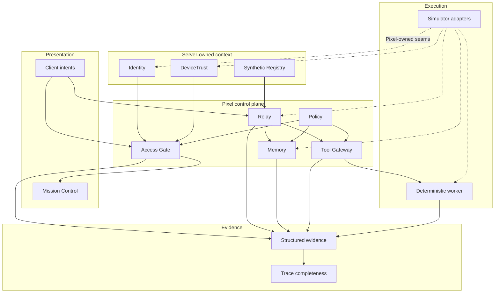

# Pixel HQ Architecture

This document is a **public-safe architectural overview** of the reviewed Alpha source. It describes shipped behavior; roadmap sections elsewhere are not proof that later features exist.

## Design goal

Pixel HQ separates organizational authority from the model, UI, hardware vendor, and workflow harness. Higher layers consume Pixel-owned contracts and deterministic decisions; adapters remain replaceable.

## Current public Alpha

## Layers

### Presentation

Mission Control renders backend decisions and device state. The browser may submit bounded intent, but it does not create identity, trust, ownership, Memory scope, grants, lifecycle state, or tool authority.

### Access Gate

PX-002 proves an application-launch decision derived from separate server-owned Identity and DeviceTrust context plus deterministic Policy. Missing, invalid, stale, revoked, or conflicting trust data fails closed.

### Relay

PX-003 owns canonical job identity and lifecycle. Idempotency is atomic, job state is server-owned, and the current slice permits at most one worker invocation per canonical job.

### Memory

PX-004 proves strict intake/record/context/package contracts, server-owned scope and environment, deterministic post-adapter filtering and lexical relevance, whole-record budgets, and Relay-linked evidence. Memory text is inert data: it cannot widen permissions, mutate Relay, alter Policy, or mint Tool Gateway capability.

The service copies and revalidates adapter-returned records before filtering/scoring. Filtering occurs before relevance so cross-scope restricted content cannot influence model-facing ranking or evidence details.

### Tool Gateway

Execution-time capabilities are resolved at the boundary where a tool action would occur. The worker cannot self-grant capability by including permission-shaped text in a request.

### Adapters

The public Alpha uses simulator implementations behind Pixel-owned seams. A future live implementation must satisfy the same boundary and is still revalidated by the receiving Pixel service.

### Evidence

Security and lifecycle events are emitted as bounded structured evidence. Completeness checks validate expected causal relationships instead of treating console output or a model transcript as the audit record.

## Architectural invariants

1. **Client/model/Memory content is data, never authority.**
2. **Identity and device trust are independent inputs.**
3. **Authorization and scope are deterministic server code, not an LLM judgment.**
4. **Tool capability is resolved at execution time.**
5. **Memory scope/handling are server-owned and filtered before relevance.**
6. **Adapters are untrusted boundaries and must be copied/revalidated where required.**
7. **Security-sensitive failures are bounded and fail closed.**
8. **Mission Control reflects canonical backend state; it does not invent it.**
9. **Evidence must be reconstructable without hidden model reasoning.**
10. **Simulation, Shadow, Canary, and Production are distinct maturity boundaries.**

## Completed slices

| Milestone | Core proof |
| --- | --- |
| PX-001 | Device snapshot contract, storage simulation, projection, Mission Control, degraded-state handling |
| PX-002 | Identity + DeviceTrust + Policy → Access Gate decision |
| PX-003 | Relay lifecycle + Tool Gateway + deterministic worker + causal evidence |
| PX-004 | Memory intake/context contracts + server-owned scope + deterministic filtering/budgets + Relay-linked evidence |

See [`docs/architecture/alpha-milestones.md`](docs/architecture/alpha-milestones.md) for the public milestone summary.

## Not production claims

The current source does **not** provide production PKI, secret storage, durable queues/databases, durable audit retention, production network exposure, real infrastructure adapters, disaster recovery, autonomous patching, a continuously running LLM workforce, or a production-grade Memory store. Those capabilities require separate design, review, and promotion.
