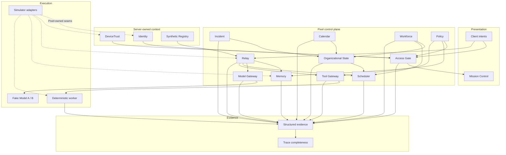

# Pixel HQ Architecture

This document is a **public-safe architectural overview** of the reviewed Alpha source. It describes shipped behavior; roadmap sections elsewhere are not proof that later features exist.

## Design goal

Pixel HQ separates organizational authority from the model, UI, hardware vendor, and workflow harness. Higher layers consume Pixel-owned contracts and deterministic decisions; adapters remain replaceable.

## Reviewed OSS-006 candidate

Public `main` currently contains PX-001 through PX-005. This candidate adds reviewed PX-006 through PX-010 and does not publish PX-011+.

## Layers

### Presentation

Mission Control renders backend decisions and device state. The browser may submit bounded intent, but it does not create identity, trust, ownership, Memory scope, grants, lifecycle state, or tool authority.

Mission Control Home is a read-only overview over injected canonical sources. The server owns the exact decimal freshness order, validates bounded section projections, and exposes only a GET endpoint. The browser renders explicit AVAILABLE, STALE, UNAVAILABLE, DENIED, FAILED, and UNKNOWN states; it never reconstructs authority or mutates canonical state.

### Access Gate

PX-002 proves an application-launch decision derived from separate server-owned Identity and DeviceTrust context plus deterministic Policy. Missing, invalid, stale, revoked, or conflicting trust data fails closed.

### Relay

PX-003 owns canonical job identity and lifecycle. Idempotency is atomic, job state is server-owned, and the current slice permits at most one worker invocation per canonical job.

### Memory

PX-004 proves strict intake/record/context/package contracts, server-owned scope and environment, deterministic post-adapter filtering and lexical relevance, whole-record budgets, and Relay-linked evidence. Memory text is inert data: it cannot widen permissions, mutate Relay, alter Policy, or mint Tool Gateway capability.

The service copies and revalidates adapter-returned records before filtering/scoring. Filtering occurs before relevance so cross-scope restricted content cannot influence model-facing ranking or evidence details.

### Tool Gateway

Execution-time capabilities are resolved at the boundary where a tool action would occur. The worker cannot self-grant capability by including permission-shaped text in a request.

### Model Gateway

PX-005 exposes only the Pixel-owned `SYSTEM_STATUS_SUMMARY` operation. Relay resolves an approved immutable Memory package, enters RUNNING, creates and claims the canonical invocation, and later owns terminal commit. Model Gateway receives only read access to canonical job state. Operation eligibility is separate from placement: the exact read-only system-status tuple is required before deterministic `simulation → Fake Model A` or `dev → Fake Model B` routing. Gateway outcomes are bounded untrusted inputs that Relay revalidates against eligibility, route, placement, and budget state; they are never lifecycle authority.

The fixed instruction and approved item text are measured in Pixel Alpha token units with the existing Memory tokenizer. This accounting is not a vendor-tokenizer, billing, or production-token claim.

### Organizational State and Scheduler

PX-006 adds canonical approvals, delegations, holds, duty, capacity, and derived Company State with optimistic revision guards and Trusted Time expiry checks. Scheduler evaluates those facts into `ELIGIBLE`, `WAIT`, `HOLD`, or `DENY`, reserves capacity with bounded leases, and rechecks current facts immediately before Relay may enter `RUNNING`. Eligibility and reservations never grant authority; Access/Policy and Relay retain their existing ownership.

### Incident

PX-007 gives Incident ownership of canonical incident truth, one commander, lifecycle, phase, impact, recovery, and bounded evidence. Incident facts compose through Organizational State; incident-linked holds reuse existing classes; Scheduler rechecks incident safety at stage two. Resolving one incident cannot clear another incident or hold.

### Calendar (OSS-006 candidate)

PX-008, as candidate material in this OSS-006 export, owns planned calendar and recurring-work truth. Trusted Time provides authoritative time semantics, Organizational State composes operating facts, and Scheduler reacts to timing and eligibility conditions. Recurring occurrences use deterministic Relay idempotency and revision-guarded checkpoints; Calendar does not create a second job lifecycle engine.

### Workforce and AgentOps (OSS-006 candidate)

PX-009, as candidate material in this OSS-006 export, owns persistent synthetic Pixel employee records, per-capability qualifications, causal attribution, bounded evidence, and AgentOps projections. Workforce facts compose through Organizational State and are rechecked by Scheduler immediately before `RUNNING`. Qualification is an eligibility fact, never an authorization grant; Access and Policy retain authority.

### Adapters

The public Alpha uses simulator implementations behind Pixel-owned seams. A future live implementation must satisfy the same boundary and is still revalidated by the receiving Pixel service.

### Evidence

Security and lifecycle events are emitted as bounded structured evidence. Completeness checks validate expected causal relationships instead of treating console output or a model transcript as the audit record.

## Architectural invariants

1. **Client/model/Memory content is data, never authority.**
2. **Identity and device trust are independent inputs.**
3. **Authorization and scope are deterministic server code, not an LLM judgment.**
4. **Tool capability is resolved at execution time.**
5. **Memory scope/handling are server-owned and filtered before relevance.**
6. **Adapters are untrusted boundaries and must be copied/revalidated where required.**
7. **Security-sensitive failures are bounded and fail closed.**
8. **Mission Control reflects canonical backend state; it does not invent it.**
9. **Evidence must be reconstructable without hidden model reasoning.**
10. **Simulation, Shadow, Canary, and Production are distinct maturity boundaries.**
11. **Runtime/model identity is distinct from Pixel agent identity and cannot create authority.**
12. **Scheduler eligibility and reservations cannot grant authority or create Relay lifecycle states.**
13. **Incident owns incident truth; Organizational State composes facts and Scheduler reacts.**
14. **Calendar owns planned operating facts; Relay remains the recurring-job lifecycle owner.**
15. **Workforce owns canonical employee-record truth, while AgentOps projections remain bounded evidence rather than authority.**
16. **Mission Control Home is presentation-only; freshness is exact decimal ordering, and stale or failed sources cannot render as fresh/healthy.**

## Completed slices

| Milestone | Core proof |
| --- | --- |
| PX-001 | Device snapshot contract, storage simulation, projection, Mission Control, degraded-state handling |
| PX-002 | Identity + DeviceTrust + Policy → Access Gate decision |
| PX-003 | Relay lifecycle + Tool Gateway + deterministic worker + causal evidence |
| PX-004 | Memory intake/context contracts + server-owned scope + deterministic filtering/budgets + Relay-linked evidence |
| PX-005 | Relay-owned fixed model invocation + deterministic simulator routing + bounded Gateway result/evidence |
| PX-006 | Organizational State facts + fail-closed Scheduler eligibility/reservations + stage-two start confirmation |
| PX-007 | Canonical Incident lifecycle + degraded Company State mapping + holds + stage-two safety recheck |
| PX-008 | Company Calendar/hours + immutable recurring definitions + deterministic Relay submission + bounded missed-run/overlap handling |
| PX-009 | Persistent Workforce lifecycle + capability qualification + causal attribution + bounded AgentOps projections + stage-two gate |
| PX-010 | Mission Control Home + read-only overview projection + exact freshness ordering + bounded source modes and states |

See [`docs/architecture/alpha-milestones.md`](docs/architecture/alpha-milestones.md) for the public milestone summary.

## Not production claims

The current source does **not** provide production PKI, secret storage, durable queues/databases, durable audit retention, production network exposure, production authentication, real infrastructure/model providers, vendor token accounting, fallback/retries, disaster recovery, autonomous patching, a continuously running LLM workforce, production Workforce/AgentOps management, production calendar integrations, or a production-grade Memory store. Mission Control is an unauthenticated Alpha service: it defaults to `127.0.0.1`, configuration can override the bind address, and non-loopback or production exposure requires a separately authorized security milestone.
