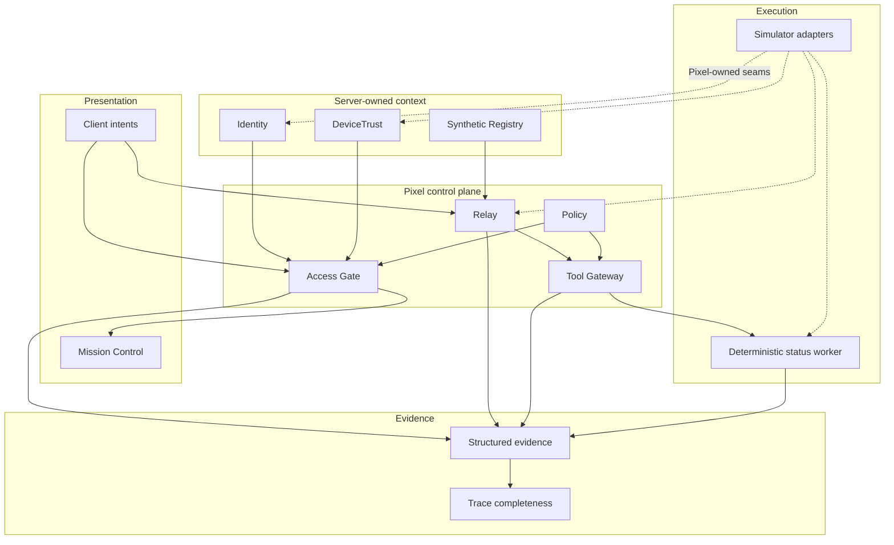

# Pixel HQ Architecture

This document is a public-safe architectural overview of the current Alpha source. It is descriptive, not a promise that later roadmap items already exist.

## Design goal

Pixel HQ separates **organizational authority** from the model, UI, hardware vendor, and workflow harness. Higher layers consume Pixel-owned contracts and deterministic decisions; adapters remain replaceable.

## Current public Alpha

## Layers

### Presentation

Mission Control renders backend decisions and device state. The browser may submit intent, but it does not create identity, trust, ownership, grants, lifecycle state, or tool authority.

### Access Gate

PX-002 proves an application-launch decision derived from separate server-owned Identity and DeviceTrust context plus deterministic Policy. Missing, invalid, stale, revoked, or conflicting trust data fails closed.

### Relay

PX-003 owns canonical job identity and lifecycle. Idempotency is atomic, the job projection is server-owned, and a canonical job is bounded to one worker invocation in the current slice.

### Tool Gateway

Execution-time capabilities are resolved at the boundary where a tool action would occur. The worker cannot self-grant capability by including permission-shaped text in a request.

### Adapters

The public Alpha uses simulator implementations behind Pixel-owned structural seams. The point is not that the simulator is production infrastructure; the point is that a future live implementation can be evaluated against the same contract rather than forcing a redesign of higher layers.

### Evidence

Security and lifecycle events are emitted as bounded structured evidence. Completeness checks validate expected causal relationships instead of treating console output or a model transcript as the audit record.

## Architectural invariants

1. **Client/model content is data, never authority.**
2. **Identity and device trust are independent inputs.**
3. **Authorization is deterministic server code, not an LLM judgment.**
4. **Tool capability is resolved at execution time.**
5. **Adapters are untrusted boundaries and must be validated.**
6. **Security-sensitive failures are bounded and fail closed.**
7. **Mission Control reflects canonical backend state; it does not invent it.**
8. **Evidence must be reconstructable without relying on hidden model reasoning.**
9. **Simulation, Shadow, Canary, and Production are distinct maturity boundaries.**
10. **Future provider/model/hardware choices must remain replaceable where the current contract allows it.**

## Completed slices

| Milestone | Core proof |
| --- | --- |
| PX-001 | Device snapshot contract, storage simulation, projection, Mission Control, degraded-state handling |
| PX-002 | Identity + DeviceTrust + Policy → Access Gate decision |
| PX-003 | Relay lifecycle + Tool Gateway + deterministic worker + causal evidence |

See [`docs/architecture/alpha-milestones.md`](docs/architecture/alpha-milestones.md) for the public milestone summary.

## Not production claims

The current source does **not** provide production PKI, secret storage, durable queues, durable audit retention, production network exposure, real infrastructure adapters, disaster recovery, autonomous patching, or a continuously running agent workforce. Those capabilities require separate design, review, and promotion.
