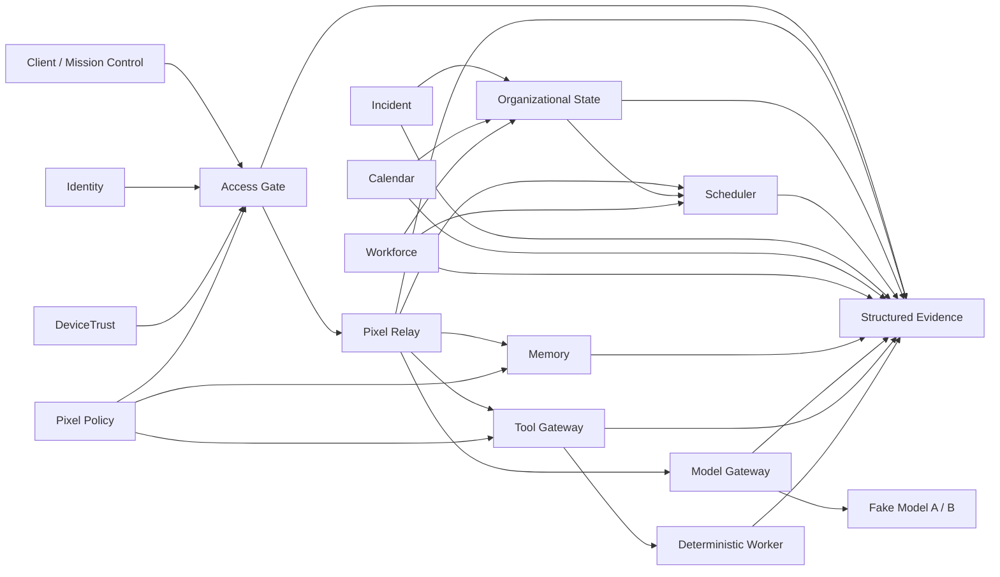

<p align="center">
  
</p>

<p align="center"><strong>Simulator-first • contract-driven • security-oriented • vendor-neutral</strong></p>

<p align="center">
  <a href="https://github.com/GrimClawBot/Pixel-HQ-OSS/actions/workflows/pixel-hq-ci.yml"></a>
  
  
  
</p>

# Pixel HQ

**Pixel HQ is a secure operating layer for AI-assisted organizations.** The current public Alpha proves that identity, device trust, jobs, Memory, model/tool execution, organizational state, scheduling, incidents, calendar/recurring work, Workforce/AgentOps, Mission Control Home, policy, and evidence can stay under deterministic Pixel-owned contracts instead of being implicitly controlled by a model, client, hardware vendor, or workflow framework.

This repository is a **public-safe Alpha architecture proof**. The current public Alpha contains PX-001 through PX-010, including the reviewed PX-005 hardening. PX-011+ is not public and is not implemented in this public Alpha. It does not claim production authentication, PKI, durable infrastructure control, recovery, or continuously running autonomous agents.

## Why Pixel HQ is different

- **Models are runtimes, not identities.** A model or coding harness can be replaced without redefining the organization.
- **Clients are not authority.** Identity, trust, ownership, lifecycle, scope, grants, and tool permissions are resolved server-side.
- **Memory is data, not authority.** Remembered text can provide context but cannot grant permissions, widen scope, or mutate job/tool authority.
- **Model invocation is bounded.** Relay owns the fixed operation and immutable invocation; Model Gateway routes only to deterministic Alpha simulators and cannot own lifecycle state.
- **Tools are capability-gated.** Execution authority is checked at the Tool Gateway rather than inferred from agent intent.
- **Scheduling is eligibility, not authority.** Scheduler decisions and reservations cannot grant permission or replace Relay lifecycle state.
- **Incident truth has one owner.** Incident facts compose through Organizational State and are rechecked immediately before execution starts.
- **Calendar owns planned operating facts.** Recurring work still enters Relay through deterministic, idempotent submission.
- **Workforce identity is persistent.** Model, provider, harness, and session identity remain replaceable implementation details, and qualification does not mint authority.
- **Simulation comes first.** Hardware-facing behavior is proven against replaceable simulator/live-shaped seams before production adapters exist.
- **Evidence is part of the design.** Material state changes and security decisions are structured so they can be reviewed and reconstructed.

## What the public Alpha proves

| Slice | What it proves | Status |
| --- | --- | --- |
| **PX-001 — Device state** | Simulator → versioned device contract → backend projection → Mission Control, including degraded-state evidence | ✅ Public Alpha |
| **PX-002 — Trust / access** | Identity + DeviceTrust → deterministic Access Gate; browser claims never become authority | ✅ Public Alpha |
| **PX-003 — Job execution** | Atomic Relay lifecycle → Tool Gateway → deterministic worker → bounded result + causal evidence | ✅ Public Alpha |
| **PX-004 — Memory / context** | Strict intake/record/package contracts → server-owned scope → post-adapter policy/relevance filtering → bounded context + Relay-linked evidence | ✅ Public Alpha |
| **PX-005 — Model Gateway** | Relay-owned fixed `SYSTEM_STATUS_SUMMARY` invocation bound to an approved Memory package → exact read-only eligibility → deterministic `simulation`/`dev` simulator routing → bounded Gateway outcome + Relay-owned terminal evidence | ✅ Public Alpha |
| **PX-006 — Organizational State + Scheduler** | Canonical coordination facts → fail-closed eligibility → lease-bounded capacity reservation → stage-two start confirmation | ✅ Public Alpha |
| **PX-007 — Incident + degraded state** | Canonical incident lifecycle → deterministic Company State mapping → incident-linked holds → stage-two safety recheck | ✅ Public Alpha |
| **PX-008 — Company Calendar + recurring work** | Half-open calendar/hours → immutable recurring definitions → deterministic Relay submission → bounded missed-run and overlap handling | ✅ Public Alpha |
| **PX-009 — Workforce + AgentOps** | Persistent employee lifecycle → per-capability qualification → causal attribution → bounded AgentOps projections → stage-two Workforce gate | ✅ Public Alpha |
| **PX-010 — Mission Control Home** | Read-only canonical overview → exact freshness ordering → bounded projections → explicit stale/unavailable/failed states → accessible owner surface | ✅ Public Alpha |

## Try Pixel HQ in 60 seconds

Requirements: **Node.js 22+** and Git. There are **no third-party runtime dependencies**.

```bash
git clone https://github.com/GrimClawBot/Pixel-HQ-OSS.git
cd Pixel-HQ-OSS
npm run check
npm start
```

Open `http://127.0.0.1:4173`.

Want to see the deterministic failure path?

```bash
npm run start:degraded
```

See [`docs/DEMO.md`](docs/DEMO.md) for the guided walkthrough.

<p align="center">
  
</p>

## Architecture at a glance



**Authority flows through Pixel services; client/model/Memory text is data.**

Read [`ARCHITECTURE.md`](ARCHITECTURE.md) and [`THREAT_MODEL.md`](THREAT_MODEL.md) for the deeper model.

## Security by construction

The public Alpha includes explicit tests for fail-closed behavior, forged authority, revoked/untrusted devices, cross-department restricted data, Relay idempotency, malformed adapter output, bounded authority traversal, inert prompt injection, deterministic Memory filtering, reservation races, stale revisions, incident/calendar/workforce seam failure, recurring submission replay, checkpoint and qualification expiry, Mission Control freshness and bounds, source-mode propagation, stage-two safety rechecks, bounded results, and evidence completeness.

## Project map

- `adapters/simulator/` — deterministic Alpha providers, stores, workers, and fake models
- `packages/contracts/` — versioned contracts and JSON Schemas
- `packages/adapter-sdk/` — replaceable runtime boundaries
- `packages/registry/` — synthetic public composition fixture
- `packages/telemetry/` — structured evidence and completeness checks
- `services/` — device projection, Policy, Access Gate, Relay, Memory, Model Gateway, Tool Gateway, Organizational State, Scheduler, Incident, Calendar, and Workforce
- `apps/mission-control/` — lightweight presentation and local composition
- `tests/` — contract, integration, security, UI, and evidence coverage
- `docs/` — public architecture and demo documentation

## Project direction

See [`ROADMAP.md`](ROADMAP.md). It separates **shipped public Alpha**, **next work**, and **later direction** so roadmap ideas are not mistaken for current functionality.

## Contributing and support

Start with [`CONTRIBUTING.md`](CONTRIBUTING.md) and [`SUPPORT.md`](SUPPORT.md). Security-sensitive reports belong through [`SECURITY.md`](SECURITY.md), not a public exploit issue.

## Release history

See [`CHANGELOG.md`](CHANGELOG.md). GitHub release tags remain maintainer-gated.

The current public Alpha contains PX-001 through PX-010, including the reviewed PX-005 hardening. The latest tagged release (`v0.2.0-alpha`) still predates PX-005, so no tagged release includes the PX-005 hardening or PX-006 through PX-010; a new tag or release remains a separate maintainer-gated decision. PX-011+ is not public and is not implemented in this public Alpha.

## License

The reviewed public source is licensed under the [Apache License 2.0](LICENSE). Project names and marks are not licensed beyond customary descriptive use.
