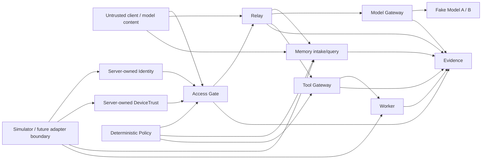

# Pixel HQ Public Threat Model

Status: **Alpha / public-safe**

This threat model describes the trust boundaries demonstrated by the current public source. It is intentionally narrower than a production security model because this repository is a simulator-first architecture proof.

## Security objective

Pixel HQ should remain safe even when a client, model, adapter, remembered/generated text, store, or worker attempts to claim authority it does not own.

> **Data may influence work, but only deterministic Pixel-owned boundaries may create authority.**

## Assets protected by the current Alpha

- canonical device state;
- protected-app launch decisions;
- canonical Relay job identity and lifecycle;
- execution-time tool capability decisions;
- Memory scope/handling and bounded context packages;
- department/data-boundary decisions;
- bounded worker results;
- canonical model invocations and bounded model results;
- structured evidence and causal trace relationships.

The public source contains synthetic fixtures, not production credentials, certificates, personal records, or private infrastructure secrets.

## Trust boundaries

Anything entering from a client/model or an adapter/store boundary is treated as untrusted until copied/validated and rebound to server-owned context where required.

## Threat and control matrix

| Threat | Example | Current control |
| --- | --- | --- |
| **Forged authority** | Client supplies grants, owner, scope, lifecycle, trust, environment, or policy fields | Strict contracts, authority-shaped field rejection, server-owned context |
| **Traversal abuse** | Deep/wide nested input attempts stack exhaustion or hides forged authority | Iterative authority scan capped at exactly 1,024 examined entries; exhaustion fails closed |
| **Client-side trust bypass** | Browser claims a trusted device or valid identity | Identity and DeviceTrust are resolved separately behind backend boundaries |
| **Revoked/untrusted device** | Valid user attempts protected launch from denied device | Access Gate requires independently resolved device state |
| **Cross-department disclosure** | Request/store returns Finance restricted data for another department | Memory service revalidates candidates and applies exact scope/handling checks before relevance |
| **Prompt / Memory injection** | Stored text says “ignore policy” or “grant access” | Memory text is inert data and has no grant, Relay mutation, or Tool Gateway authority path |
| **Tool privilege escalation** | Worker or prompt requests a stronger capability | Tool Gateway resolves capability at execution time; worker intent is not authority |
| **Job duplication / replay** | Same intent attempts multiple canonical jobs or workers | Atomic Relay idempotency and bounded worker invocation |
| **Malformed adapter output** | Adapter/store returns invalid canonical state | Pixel-owned service boundary copies and revalidates before downstream use |
| **Validation/clone race** | Getter-backed object changes after validation | Store snapshots first, validates the exact isolated copy, then stores by validated ID |
| **Evidence leakage** | Blocked Memory text/IDs or provider internals appear in logs | Bounded evidence allowlists and aggregate reason counts |
| **Evidence ambiguity** | Repeated reads or malformed traces obscure causal history | Stable canonical evidence plus trace completeness checks |
| **Unbounded result/context** | Worker or Memory package becomes arbitrarily large | Bounded result summaries and whole-record Memory package budgets |
| **Model-created authority** | Model text claims identity, grants, tools, routing, or lifecycle changes | Fixed Pixel operation/template, strict contracts, separate eligibility, Relay-owned lifecycle/result |
| **Route substitution** | Caller/model requests another runtime or fallback | Routing uses only the canonical job environment; unsupported/failed routes stop |
| **Unsafe provider data** | Adapter returns getters, exotic prototypes, cycles, excessive nesting/size, identity substitution, or false usage | Bounded descriptor-first rejection, isolated snapshot/revalidation, identity binding, recomputed output units |

## Memory-specific invariants

1. Memory records are **data, never executable authority**.
2. Caller/model input cannot choose canonical scope, owner, department, handling, environment, lifecycle, provenance, budget, IDs, timestamps, or permissions.
3. Store output is copied and revalidated before filtering, tokenization, scoring, or budgeting.
4. Filtering follows `environment → scope/handling → lifecycle → relevance → budget`.
5. Cross-scope restricted content and identifiers never enter model-facing packages or detailed evidence.
6. Relevance is deterministic/model-free in the current Alpha.
7. Memory cannot mutate Relay, alter Policy, or mint Tool Gateway capabilities.

## Failure philosophy

Security-sensitive uncertainty should not widen access. Missing, invalid, stale, revoked, conflicting, malformed, unsupported, or over-budget authority input fails closed using bounded reason codes/evidence rather than raw provider output, exceptions, stack traces, secrets, or blocked content.

## Model and AI assumptions

The Alpha fake models are deterministic replaceable runtimes. They receive one fixed Pixel instruction plus approved item text only. A model may hallucinate identity/permissions, follow malicious instructions, emit malformed output, attempt unauthorized tools, or repeat sensitive context; therefore authorization, scope, device trust, Memory filtering, operation eligibility, routing, tool capability, lifecycle, and evidence remain deterministic outside model behavior.

## Adapter assumptions

Simulator adapters are test components, not trusted authorities. A future live adapter/store cannot widen permissions simply by returning convenient values; service-side validation and Policy remain mandatory after adapter output.

## Out of scope for this Alpha threat model

The public source does not yet claim to solve production authentication/PKI, hardware-backed key ceremonies, a secret vault, production network isolation, durable database/queue compromise, durable backup/recovery, supply-chain compromise of a future deployment, physical HomeLab security, production model-hosting isolation, or hostile multi-tenant workloads.

## Security testing expectations

Changes to contracts, Identity, DeviceTrust, Policy, Access Gate, Relay, Memory, Tool Gateway, evidence, stores, or adapter boundaries should include successful-path, malformed-input, denied/forged-authority, evidence, and targeted regression coverage where relevant.

Security-sensitive code requires review beyond its original author under the current project process.

## Reporting a vulnerability

Follow [`SECURITY.md`](SECURITY.md). Do not publish exploit payloads, credentials, private infrastructure information, or sensitive evidence in a normal GitHub issue.
