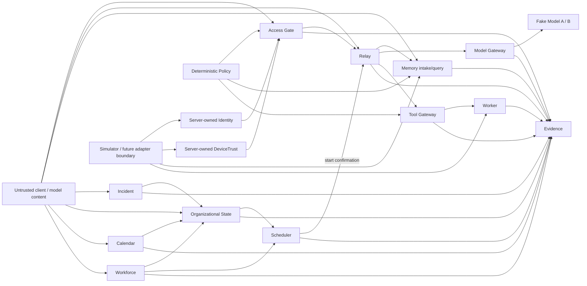

# Pixel HQ Public Threat Model

Status: **Alpha / public-safe**

This threat model describes the trust boundaries demonstrated by the current public-safe Alpha. It is intentionally narrower than a production security model because this repository is a simulator-first architecture proof. The current public Alpha contains PX-001 through PX-010, including the reviewed PX-005 hardening. PX-011+ is not public and is not implemented in this public Alpha.

## Security objective

Pixel HQ should remain safe even when a client, model, adapter, remembered/generated text, store, or worker attempts to claim authority it does not own.

> **Data may influence work, but only deterministic Pixel-owned boundaries may create authority.**

## Assets protected by the current Alpha

- canonical device state;
- protected-app launch decisions;
- canonical Relay job identity and lifecycle;
- execution-time tool capability decisions;
- Memory scope/handling and bounded context packages;
- department/data-boundary decisions;
- bounded worker results;
- canonical model invocations and bounded model results;
- canonical Organizational State approvals, delegations, holds, duty, capacity, and Company State facts;
- Scheduler eligibility decisions, capacity reservations and bounded leases, and stage-two start confirmation;
- canonical Incident state, including commander, lifecycle, response phase, recovery, and bounded evidence facts;
- incident-linked holds and deterministic degraded Company State/resource composition;
- canonical Calendar events, company hours, recurring templates/occurrences, and recurrence checkpoints;
- canonical Workforce records, qualifications, attribution, bounded evidence, and AgentOps projections;
- bounded Mission Control overview projections and exact freshness tokens;
- structured evidence and causal trace relationships.

The public source contains synthetic fixtures, not production credentials, certificates, personal records, or private infrastructure secrets.

## Trust boundaries

Anything entering from a client/model or an adapter/store boundary is treated as untrusted until copied/validated and rebound to server-owned context where required.

Access Gate and Policy own authority decisions. Relay owns canonical job lifecycle and is the only component here that may move a job into `RUNNING`. Organizational State owns canonical coordination facts, Scheduler owns execution eligibility and reservations, and Incident owns canonical incident truth. Calendar owns planned operating and recurrence facts while Trusted Time owns authoritative time semantics. Workforce owns canonical employee-record truth and AgentOps owns bounded evaluation projections. Mission Control Home is presentation-only and owns no authority. Scheduler, Incident, Calendar, Workforce, AgentOps, and Mission Control cannot mint permission.

## Threat and control matrix

| Threat | Example | Current control |
| --- | --- | --- |
| **Forged authority** | Client supplies grants, owner, scope, lifecycle, trust, environment, or policy fields | Strict contracts, authority-shaped field rejection, server-owned context |
| **Traversal abuse** | Deep/wide nested input attempts stack exhaustion or hides forged authority | Iterative authority scan capped at exactly 1,024 examined entries; exhaustion fails closed |
| **Client-side trust bypass** | Browser claims a trusted device or valid identity | Identity and DeviceTrust are resolved separately behind backend boundaries |
| **Revoked/untrusted device** | Valid user attempts protected launch from denied device | Access Gate requires independently resolved device state |
| **Cross-department disclosure** | Request/store returns Finance restricted data for another department | Memory service revalidates candidates and applies exact scope/handling checks before relevance |
| **Prompt / Memory injection** | Stored text says “ignore policy” or “grant access” | Memory text is inert data and has no grant, Relay mutation, or Tool Gateway authority path |
| **Tool privilege escalation** | Worker or prompt requests a stronger capability | Tool Gateway resolves capability at execution time; worker intent is not authority |
| **Job duplication / replay** | Same intent attempts multiple canonical jobs or workers | Atomic Relay idempotency and bounded worker invocation |
| **Malformed adapter output** | Adapter/store returns invalid canonical state | Pixel-owned service boundary copies and revalidates before downstream use |
| **Validation/clone race** | Getter-backed object changes after validation | Store snapshots first, validates the exact isolated copy, then stores by validated ID |
| **Evidence leakage** | Blocked Memory text/IDs or provider internals appear in logs | Bounded evidence allowlists and aggregate reason counts |
| **Evidence ambiguity** | Repeated reads or malformed traces obscure causal history | Stable canonical evidence plus trace completeness checks |
| **Unbounded result/context** | Worker or Memory package becomes arbitrarily large | Bounded result summaries and whole-record Memory package budgets |
| **Model-created authority** | Model text claims identity, grants, tools, routing, or lifecycle changes | Fixed Pixel operation/template, strict contracts, separate eligibility, Relay-owned lifecycle/result |
| **Route substitution** | Caller/model requests another runtime or fallback | Routing uses only the canonical job environment; unsupported/failed routes stop |
| **Unsafe provider data** | Adapter returns getters, exotic prototypes, cycles, excessive nesting/size, identity substitution, or false usage | Bounded descriptor-first rejection, isolated snapshot/revalidation, identity binding, recomputed output units |
| **Forged or malformed coordination facts** | Caller submits invalid approval, delegation, hold, duty, capacity, or Company State data | Strict contracts, bounded fail-closed validation, canonical store records, and revision-guarded updates |
| **Stale coordination or authority facts** | An expired approval/delegation or stale Company State revision is reused | Trusted Time expiry checks, optimistic revision guards, and canonical state re-read before start |
| **Reservation replay or substitution** | Expired/released reservation is reused, or a reservation for another job/resource is presented | Reservations require an issued `ELIGIBLE` evaluation and are bound to job, resource, and a bounded lease; one-way state transitions and stage-two checks reject stale, expired, cross-job, or cross-resource use |
| **Dependency or seam failure** | Dependency facts are missing or the Incident seam cannot establish trustworthy state | Missing dependency remains `WAIT`; unavailable or malformed Incident facts fail closed without fabricating safe state |
| **Forged or malformed incident facts** | Caller attempts an invalid phase, commander transfer, lifecycle state, or recovery claim | Strict Incident contracts, one-commander records, ordered lifecycle transitions, expected revisions, idempotent operation commits, and bounded evidence requirements |
| **Incident changes after eligibility** | A severe incident appears after reservation but before `RUNNING` | Scheduler stage two re-reads canonical Organizational State/Incident facts and rejects the start while Relay retains lifecycle ownership |
| **Cross-incident clearing** | Resolving one incident attempts to clear another incident or linked hold | Active incidents compose independently; incident-linked hold release requires the matching incident reference, so unrelated incidents and holds remain active |
| **Forged or malformed Calendar facts** | Caller submits an invalid event, company-hours window, recurring template, occurrence, or checkpoint | Strict Calendar contracts, exact input-field checks, revision-guarded stores, and a separate server mutation authorizer |
| **Stale Calendar or recurrence revisions** | A stale event, hours, template, occurrence, or checkpoint revision is reused | Expected revisions are required, revisions advance atomically, and occurrence state changes re-check the exact claimed revision |
| **Clock or recurrence rollback** | Caller or a store attempts to move configured time or a checkpoint backward | Trusted Time is combined with the store's observed high-water time; checkpoint updates use the current checkpoint and revision guard |
| **Occurrence replay or duplicate recurring submission** | The same recurring occurrence is replayed or submitted twice | Deterministic occurrence identity and Relay idempotency keys; the store atomically returns the existing claim and Relay output is revalidated against the exact occurrence |
| **Missed-run or overlap ambiguity** | A long outage yields many missed windows, or the prior occurrence outcome is unknown | Bounded missed-run policies and counts; unknown prior submission blocks the next overlap window rather than guessing safe execution |
| **Calendar dependency failure** | Trusted Time, Organizational State, Scheduler, or Relay seams are missing or malformed | Required dependencies are validated at construction and fail closed in seam tests without fabricating scheduling safety |
| **Forged Workforce identity** | Caller, model, provider, harness, or session claims a Pixel employee identity | A server-owned resolver confirms an existing synthetic canonical identity; unresolved or malformed identity returns null and record creation fails closed |
| **Identity/provider/model confusion** | Runtime identity is presented as persistent Pixel employee identity | Pixel employee records are separate from replaceable model, provider, harness, and session identity |
| **Unauthorized qualification claim** | A qualification is treated as access, tool, or Policy authorization | Qualification changes require a separate mutation authorizer; Scheduler uses qualification only as eligibility, while Access and Policy retain authority |
| **Stale Workforce revision or qualification** | An old lifecycle, role, department, or qualification revision is reused | Optimistic revision guards, canonical history, and Trusted Time expiry evaluation reject stale or expired facts before use |
| **Forged AgentOps evaluation or attribution** | Caller submits an evaluation or attributes work to another agent | AgentOps projections are derived deterministically from canonical evidence; attribution references supporting evidence and matches the canonical agent/subject |
| **Malformed Workforce/AgentOps output** | Store or adapter returns an invalid Workforce, qualification, evidence, attribution, or evaluation record | Strict contracts and bounded records are validated at service/store seams before downstream use |
| **Workforce evidence privacy leakage** | Private employee, provider, performance, credential, or raw evaluation data enters public evidence | Public fixtures are synthetic; evidence fields and references are bounded, and private rosters or raw private AgentOps evidence are not exported |
| **Browser/UI state mistaken for authority** | Client or browser content claims identity, grants, lifecycle, incident, Scheduler, Workforce, Calendar, Memory, model, tool, or evidence authority | Mission Control Home is read-only, validates a strict projection contract, and has no mutation path into canonical authority |
| **Stale overview overwrites fresher state** | An older or duplicate HTTP response arrives after a newer projection | Freshness is an exact decimal `{ epoch, sequence }` pair; browser BigInt comparison rejects equal or older tokens |
| **Freshness token precision loss** | Large token values are converted through a lossy numeric type | Tokens remain decimal strings and comparisons use BigInt; Number conversion is not used for ordering |
| **Oversized projection materialization** | A section or whole overview exceeds its bound | Section counters, arrays, text, metadata, and envelope size are validated; oversized projections fail minimally with `PROJECTION_TOO_LARGE` |
| **Raw payload leakage** | Recent Work, Workforce, incidents, or overview data expose worker/tool/model payloads, prompts, reasoning, or private employee records | Recent Work and Workforce projections are read-only and bounded; the public source contains synthetic aggregates and does not export raw private payloads or rosters |
| **Source mode mislabeling** | Shadow execution or simulator data is presented as LIVE, or source provenance is removed | Source mode is explicit (`SIMULATED`/`SHADOW`/`LIVE`), derived from canonical source/environment facts, and checked for storage source consistency |
| **Failed/unavailable source becomes falsely healthy** | A missing, failed, stale, denied, or unknown source renders as fresh/healthy | Mission Control renders explicit availability states, isolates section failures, and does not infer incident absence from uncertainty |
| **Presentation becomes a mutation surface** | UI or overview HTTP layer attempts to change canonical state | The overview endpoint accepts only GET, rejects query/body-bearing requests, and returns validated read-only projections |
| **Unauthenticated non-loopback exposure** | The Alpha service is exposed beyond localhost without a production security milestone | Mission Control is unauthenticated; it defaults to `127.0.0.1`, configuration can override the bind address, and non-loopback or production exposure requires separate authorization |

## Memory-specific invariants

1. Memory records are **data, never executable authority**.
2. Caller/model input cannot choose canonical scope, owner, department, handling, environment, lifecycle, provenance, budget, IDs, timestamps, or permissions.
3. Store output is copied and revalidated before filtering, tokenization, scoring, or budgeting.
4. Filtering follows `environment → scope/handling → lifecycle → relevance → budget`.
5. Cross-scope restricted content and identifiers never enter model-facing packages or detailed evidence.
6. Relevance is deterministic/model-free in the current Alpha.
7. Memory cannot mutate Relay, alter Policy, or mint Tool Gateway capabilities.

## Failure philosophy

Security-sensitive uncertainty should not widen access. Missing, invalid, stale, revoked, conflicting, malformed, unsupported, or over-budget authority input fails closed using bounded reason codes/evidence rather than raw provider output, exceptions, stack traces, secrets, or blocked content.

## Model and AI assumptions

The Alpha fake models are deterministic replaceable runtimes. They receive one fixed Pixel instruction plus approved item text only. A model may hallucinate identity/permissions, follow malicious instructions, emit malformed output, attempt unauthorized tools, or repeat sensitive context; therefore authorization, scope, device trust, Memory filtering, operation eligibility, routing, tool capability, lifecycle, and evidence remain deterministic outside model behavior.

## Adapter assumptions

Simulator adapters are test components, not trusted authorities. A future live adapter/store cannot widen permissions simply by returning convenient values; service-side validation and Policy remain mandatory after adapter output.

## Out of scope for this Alpha threat model

The public source does not yet claim to solve production authentication/PKI, hardware-backed key ceremonies, a secret vault, production network isolation, durable database/queue compromise, durable backup/recovery, production Workforce/AgentOps management, production calendar integrations, non-loopback Mission Control exposure, supply-chain compromise of a future deployment, physical HomeLab security, production model-hosting isolation, or hostile multi-tenant workloads.

## Security testing expectations

Changes to contracts, Identity, DeviceTrust, Policy, Access Gate, Relay, Memory, Tool Gateway, Organizational State, Scheduler, reservations, Incident, Calendar/recurring work, Workforce/AgentOps, Mission Control overview/freshness/source-mode behavior, incident/degraded-state/calendar/workforce seams, evidence, stores, or adapter boundaries should include successful-path, malformed-input, denied/forged-authority, stale/replay, evidence, and targeted regression coverage where relevant.

Security-sensitive code requires review beyond its original author under the current project process.

## Reporting a vulnerability

Follow [`SECURITY.md`](SECURITY.md). Do not publish exploit payloads, credentials, private infrastructure information, or sensitive evidence in a normal GitHub issue.
