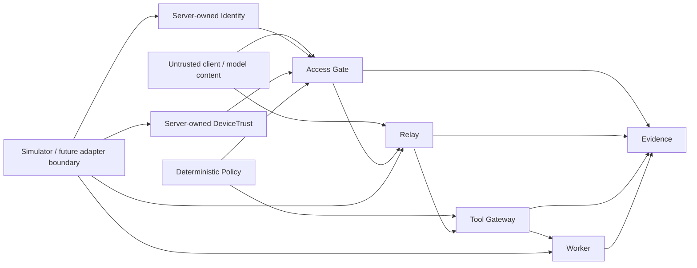

# Pixel HQ Public Threat Model

Status: **Alpha / public-safe**

This threat model describes the trust boundaries demonstrated by the current public source. It is intentionally narrower than a production security model because this repository is a simulator-first architecture proof.

## Security objective

Pixel HQ should remain secure even when a client, model, adapter, remembered/generated text, or worker attempts to claim authority it does not own.

The central rule is:

> **Data may influence work, but only deterministic Pixel-owned boundaries may create authority.**

## Assets protected by the current Alpha

- canonical device state;
- application-launch decisions;
- canonical Relay job identity and lifecycle;
- execution-time tool capability decisions;
- bounded worker results;
- department/data-boundary decisions;
- structured evidence and causal trace relationships.

The current source does not contain real credentials, production certificates, personal data, or production infrastructure secrets.

## Trust boundaries

Anything entering from the left or through an adapter is treated as untrusted until validated and rebound to server-owned context.

## Threat and control matrix

| Threat | Example | Current control |
| --- | --- | --- |
| **Forged authority** | Client supplies grants, owner, lifecycle, trust, or worker fields | Strict contracts, server-owned context, unknown/authority-shaped fields rejected |
| **Client-side trust bypass** | Browser claims a trusted device or valid identity | Identity and DeviceTrust are resolved separately behind backend boundaries |
| **Revoked/untrusted device** | Valid user attempts protected launch from denied device | Access Gate requires the independently resolved device state |
| **Cross-department disclosure** | Request tries to retrieve raw data outside its permitted department | Deterministic Policy proof denies the raw-data path |
| **Tool privilege escalation** | Worker or prompt requests a stronger capability | Tool Gateway resolves capability at execution time; worker intent is not authority |
| **Job duplication / replay** | Same intent attempts to create multiple canonical jobs or workers | Atomic Relay idempotency and bounded worker invocation |
| **Malformed adapter output** | Simulator/live-shaped adapter returns invalid state | Pixel-owned boundary validation; invalid data fails closed |
| **Evidence ambiguity** | Repeated reads or malformed traces obscure what happened | Stable canonical evidence plus causal completeness checks |
| **Unbounded output** | Tool/worker tries to emit arbitrary large or sensitive result material | Bounded result summaries and evidence attribute limits |
| **Prompt injection** | Text says “ignore policy” or “grant access” | Text has no authority path; deterministic Policy/Tool Gateway decisions are separate |

## Failure philosophy

Security-sensitive uncertainty should not widen access. Missing, invalid, stale, conflicting, malformed, or unsupported authority context is expected to fail closed and return bounded reason codes/evidence rather than raw exceptions, secrets, or arbitrary provider output.

## Model and AI assumptions

The current public Alpha does not require a continuously running LLM. If a future model is attached, the security model assumes the model may:

- follow malicious instructions;
- hallucinate identity or permissions;
- produce malformed output;
- attempt unauthorized tool usage;
- repeat sensitive text it was given.

Therefore a model must remain downstream of deterministic identity, Policy, Relay, Tool Gateway, and data-boundary controls.

## Adapter assumptions

Simulator adapters are test components, not trusted authorities. A future live adapter must not be able to widen permissions simply by returning a convenient value. Service-side validation and policy checks remain necessary after adapter output.

## Out of scope for this Alpha threat model

The public source does not yet claim to solve:

- production authentication/PKI;
- hardware-backed identity or key ceremonies;
- secret-vault implementation;
- production network isolation;
- durable database/queue compromise;
- production backup/recovery;
- supply-chain compromise of a future deployment;
- physical HomeLab security;
- production model hosting isolation;
- multi-tenant hostile workloads.

Those require separate threat-model revisions when the corresponding implementation is promoted.

## Security testing expectations

Changes to contracts, Identity, DeviceTrust, Policy, Access Gate, Relay, Tool Gateway, evidence, or adapter boundaries should include:

1. a successful-path test;
2. a malformed-input test;
3. a forged-authority or denied-path test where relevant;
4. evidence/trace assertions;
5. regression coverage for any security finding being corrected.

Security-sensitive code also requires review beyond its original author before merge under the current project process.

## Reporting a vulnerability

Follow [`SECURITY.md`](SECURITY.md). Do not publish exploit payloads, credentials, private infrastructure information, or sensitive evidence in a normal GitHub issue.
